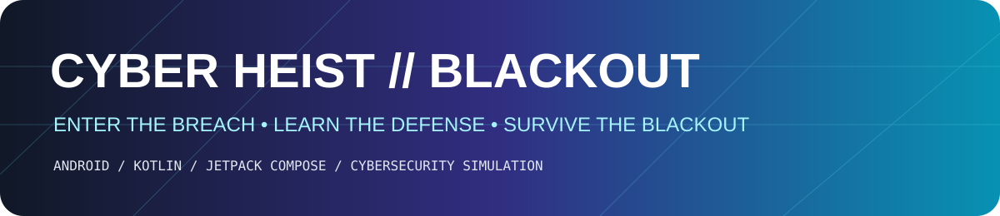
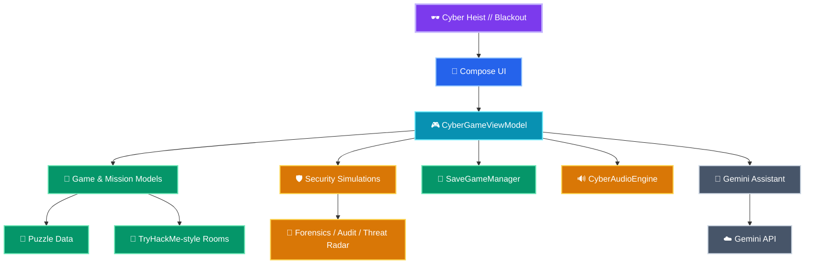
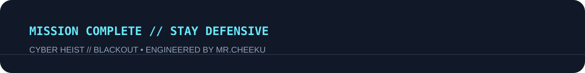

<div align="center">



<p>
  <a href="https://github.com/MrCheeku/Cyber-Heist-Blackout"></a>
  <a href="https://github.com/MrCheeku/Cyber-Heist-Blackout"></a>
  <a href="https://img.shields.io/github/repo-size/MrCheeku/Cyber-Heist-Blackout"></a>
</p>

<p><strong>Story-driven cyber operations • Security puzzles • Defensive learning • Android</strong></p>

<a href="https://github.com/MrCheeku"></a>

</div>

---

## 🕶️ What is Cyber Heist // Blackout?

**Cyber Heist // Blackout** is an Android cybersecurity game that turns defensive-security concepts into a cinematic, interactive operation. Built with **Kotlin + Jetpack Compose**, it combines missions, simulated attacks, encryption puzzles, digital forensics, network challenges, security audits, upgrades, and an optional Gemini-powered assistant.

The world inside the app is a **self-contained simulation**. Targets, credentials, flags, packets, terminals, and attack-boxes are fictional game data.

### ✨ Highlights

| Capability | What it does |
|---|---|
| **Mission Campaign** | Story-driven operations with objectives, scores, upgrades, and multiple endings. |
| **Cyberpunk Interface** | Boot sequence, terminal UI, threat panels, animated backgrounds, audio, and themed Compose components. |
| **Interactive Security Lab** | Guided simulations and hands-on security mini-games. |
| **Network Maze** | Solve a fictional network-navigation challenge under pressure. |
| **Encryption Puzzles** | Encoding and cryptography-inspired challenges. |
| **Digital Forensics** | Inspect simulated evidence and reconstruct incidents. |
| **Threat Radar** | Respond to fictional real-time threat events. |
| **Personal Security Audit** | Review practical defensive-security habits and controls. |
| **TryHackMe-style Rooms** | Self-contained simulated rooms with no real targets. |
| **Gemini Cyber Assistant** | Optional AI chat for explanations, hints, and mission guidance. |
| **Progression System** | Leaderboards, upgrades, save data, replayability, and multiple outcomes. |

> ⚠️ **Safety rule:** use the project only as a simulation and educational tool. Never apply its workflows to systems you do not own or have explicit permission to test.

---

## ✨ Core Experience

```text
BOOT → INVESTIGATE → SOLVE → DEFEND → UPGRADE → RESCAN → SURVIVE
```

A central `CyberGameViewModel` coordinates player state, missions, simulated threats, puzzle interactions, persistence, audio, and optional AI assistance.

## 🎬 Cyber Operation Preview

<div align="center">


> 🎥 **Visual preview:** the project includes its own cyberpunk artwork and themed Android UI. The complete experience contains missions, labs, terminal gameplay, forensics, encryption, threat radar, and simulated TryHackMe-style rooms.

</div>

---

## 🧰 Tech Stack

<div align="center">

### Android & UI


### Architecture


### Security & AI


</div>

---

## 🧭 Project Structure

> 🎨 **Interactive Mermaid architecture:** compact, color-coded, and organized like the author's other repositories.



### 📱 Mobile-friendly note

This is **real Mermaid source—not a screenshot**. GitHub controls Mermaid rendering in each client.

<details>
<summary>📂 View Project Structure as Text</summary>

```text
🕶️ Cyber-Heist-Blackout
│
├── 📱 app/
│   ├── 🧩 src/main/java/com/example/
│   │   ├── cyberheist/
│   │   │   ├── audio/
│   │   │   ├── data/
│   │   │   ├── model/
│   │   │   ├── ui/
│   │   │   │   ├── components/
│   │   │   │   └── screens/
│   │   │   └── viewmodel/
│   │   └── ui/theme/
│   ├── 🧪 src/test/
│   ├── 🧪 src/androidTest/
│   └── ⚙️ build.gradle.kts
│
├── 🎨 assets/
│   ├── header.svg
│   └── footer.svg
├── 🔑 .env.example
├── 🛡️ SECURITY.md
├── 🤝 CONTRIBUTING.md
├── 📄 LICENSE
├── 📋 metadata.json
├── ⚙️ build.gradle.kts
├── ⚙️ gradle.properties
├── 📦 gradle/libs.versions.toml
└── ⚙️ settings.gradle.kts
```

</details>

### 🔄 How the pieces connect

```text
📱 Compose Screens + Components
             │
             ▼
      🎮 Game ViewModel
       │    │    │    │
       │    │    │    └────► 🤖 Optional Gemini Assistant
       │    │    │
       │    │    └─────────► 🔊 Audio Engine
       │    │
       │    └──────────────► 💾 Local Save Data
       │
       └───────────────────► 🧠 Missions + Security Simulations
```

The repository separates UI, game orchestration, models, persistence, audio, simulations, and AI integration so contributors can locate each responsibility quickly.

---

## 🛡️ Security Design

- No real private keys or production credentials are required by the game.
- Gemini configuration is local-only through `GEMINI_API_KEY`.
- Release signing values are supplied through environment variables.
- Common secret-bearing files are ignored by Git.
- Simulated private-key content in educational rooms is redacted rather than storing usable key material.
- TryHackMe-style rooms are self-contained game simulations.

See [`SECURITY.md`](SECURITY.md) for the repository security policy.

---

## 🚀 Getting Started

### Requirements

- Android Studio with a recent stable Android/Gradle toolchain
- JDK 11+
- Android SDK matching the configured compile/target SDK

### Open in Android Studio

1. Clone the repository.
2. Open it in Android Studio.
3. Sync Gradle.
4. Run the `app` configuration on an emulator or Android device.

### Configure optional Gemini AI

Create a local `.env` from `.env.example` and set:

```text
GEMINI_API_KEY=your_real_key_here
```

> Never commit `.env`, API keys, keystores, passwords, or exported credentials.

---

## 🧪 Testing

The project includes JVM tests, Android instrumentation tests, Compose UI testing support, Robolectric, and Roborazzi screenshot tooling.

```bash
gradle test
gradle assembleDebug
gradle connectedAndroidTest
```

> The repository does not currently include the Gradle wrapper scripts (`gradlew` / `gradlew.bat`). You can run these tasks from Android Studio or from a system Gradle installation.

---

## ⚠️ Demo / Simulation Scope

Cyber Heist // Blackout is an educational game, not a production penetration-testing platform. Simulated terminals, flags, network addresses, attack-boxes, credentials, and vulnerabilities exist to support gameplay and learning.

---

## 🗺️ Roadmap

- [x] Story-driven cyber operations
- [x] Cyberpunk Jetpack Compose interface
- [x] Mission progression and multiple endings
- [x] Encryption / encoding puzzles
- [x] Network and forensics simulations
- [x] Security concepts and defensive labs
- [x] Local save system
- [x] Optional Gemini AI assistant
- [x] TryHackMe-style self-contained rooms
- [ ] Expanded mission packs
- [ ] More accessibility options
- [ ] Achievement / challenge system
- [ ] Expanded replay modifiers
- [ ] Release-ready Play Store assets

---

## 🌐 Official Links

<div align="center">

<p>
  <a href="https://techwithcheeku.lovable.app/"></a>
</p>

<p>
  <a href="https://whatsapp.com/channel/0029Vb9OpwgD8SDvISwrn73Y"></a>
</p>

<p>
  <a href="https://discord.gg/GWJvzcxu"></a>
</p>

<sub>Official community and project links for Tech with Cheeku.</sub>

</div>

---

## 👨‍💻 Engineered By

<div align="center">

<a href="https://github.com/MrCheeku"></a>

### **Mr.Cheeku**

<a href="https://github.com/MrCheeku"></a>

</div>

---

<div align="center">

<a href="https://github.com/MrCheeku/Cyber-Heist-Blackout/issues">Report an issue</a>
&nbsp;•&nbsp;
<a href="https://github.com/MrCheeku/Cyber-Heist-Blackout">View source</a>
&nbsp;•&nbsp;
<a href="https://github.com/MrCheeku">Developer profile</a>

<br /><br />



</div>
