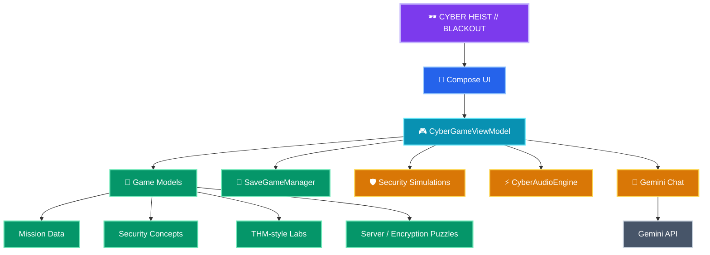

<div align="center">


# CYBER HEIST // BLACKOUT

<strong>Enter the breach. Learn the defense. Survive the blackout.</strong>

<p>
  
  
  
  
</p>

<p>
  <a href="https://github.com/MrCheeku"></a>
</p>

</div>

---

## 🕶️ What is Cyber Heist // Blackout?

**Cyber Heist // Blackout** is an immersive Android cybersecurity game built with **Kotlin + Jetpack Compose**. It turns defensive-security concepts into an interactive cyber-operation: follow the story, solve technical puzzles, inspect simulated threats, strengthen defenses, and learn why the controls matter.

The project is designed as a **safe simulation**. The terminal, network, attack-box, credentials, packets, and target systems are fictional game systems rather than real-world infrastructure.

### ✨ Highlights

| Capability | What it does |
|---|---|
| **Cinematic Boot Sequence** | Drops the player into the operation with a cyberpunk terminal-style intro. |
| **Mission System** | Progress through story-driven missions with stateful objectives, scores, upgrades, and endings. |
| **Interactive Security Lab** | Explore hands-on simulations built around common security concepts. |
| **Network Maze** | Navigate a fictional network puzzle and make defensive decisions under pressure. |
| **Encryption Puzzles** | Solve encoding/crypto-inspired challenges to advance the story. |
| **Digital Forensics** | Investigate simulated evidence and piece together what happened. |
| **Threat Radar** | Track fictional live events and respond to changing security conditions. |
| **Security Audit** | Review personal-security concepts and defensive controls in a guided experience. |
| **TryHackMe-style Lab** | Practice inside a self-contained attack-box/target-browser simulation with no external target required. |
| **Cyber AI Chat** | Optional Gemini-powered in-game assistant for explanations and mission guidance. |
| **Leaderboards & Upgrades** | Replay, improve your score, and customize your cyber-operator progression. |
| **Save Game** | Persist player progress locally on-device. |

> **Safety:** This app is an educational simulation. Do not use its fictional workflows, examples, or commands against systems you do not own or have explicit permission to test.

---

## 🎮 Core Experience

```text
BOOT → INVESTIGATE → SOLVE → DEFEND → UPGRADE → RESCAN → SURVIVE
```

The game combines narrative progression with technical mini-games. Each system feeds the central `CyberGameViewModel`, which coordinates missions, player state, threats, lab interactions, save data, and optional AI assistance.

---

## 🧭 Project Architecture



### 📂 Project structure

```text
🕶️ Cyber-Heist-Blackout
│
├── 📱 app/
│   ├── src/main/java/com/example/cyberheist/
│   │   ├── audio/
│   │   │   └── CyberAudioEngine.kt
│   │   ├── data/
│   │   │   ├── SaveGameManager.kt
│   │   │   ├── GeminiApiService.kt
│   │   │   └── GeminiChatRepository.kt
│   │   ├── model/
│   │   │   ├── GameState.kt
│   │   │   ├── MissionData.kt
│   │   │   ├── SecurityConcepts.kt
│   │   │   ├── ServerPuzzleModels.kt
│   │   │   ├── TryHackMeModels.kt
│   │   │   └── GeminiChatModels.kt
│   │   ├── ui/
│   │   │   ├── components/
│   │   │   └── screens/
│   │   └── viewmodel/
│   │       └── CyberGameViewModel.kt
│   ├── src/test/
│   └── src/androidTest/
│
├── ⚙️ gradle/
├── 📄 .env.example
├── 📄 SECURITY.md
├── 📄 CONTRIBUTING.md
├── 📄 LICENSE
├── ⚙️ build.gradle.kts
├── ⚙️ gradle.properties
├── ⚙️ settings.gradle.kts
└── 📖 README.md
```

### 🔄 How the pieces connect

```text
📱 Screens + Components
          │
          ▼
🎮 CyberGameViewModel
   ├──► 🧠 Mission / puzzle data
   ├──► 🛡️ Security simulations
   ├──► 💾 SaveGameManager
   ├──► 🔊 Audio engine
   └──► 🤖 Optional Gemini assistant
```

The repository keeps gameplay orchestration, reusable UI, data models, persistence, audio, and network-facing AI code separated so contributors can work on one layer without hunting through the whole app.

---

## 🛡️ Security & Privacy

Cyber Heist // Blackout is built around **fictional game data**, not production credentials or real attack targets.

- Real API keys belong in local secrets only; `.env` is ignored by Git.
- Release signing values are read from environment variables rather than stored in the repository.
- Debug builds use Android's normal debug signing instead of a checked-in keystore.
- The repository excludes common secret-bearing files such as `.env`, `.jks`, `.keystore`, `.pem`, `.key`, and credential files.
- The in-game attack scenarios are simulations. No real target discovery or exploitation infrastructure is bundled.

See [`SECURITY.md`](SECURITY.md) for the repository's security policy and secret-handling guidance.

---

## 🤖 Optional Gemini Assistant

The game can use a Gemini API key for its optional AI chat experience.

### Local configuration

Create a local `.env` file from the example:

```bash
cp .env.example .env
```

Then set:

```text
GEMINI_API_KEY=your_real_key_here
```

Never commit `.env`, API keys, copied secrets, or exported credentials.

> The app remains usable without a real key for the core offline game experience; AI chat requires a valid local configuration.

---

## 🚀 Getting Started

### Requirements

- Android Studio with a recent stable Android toolchain
- JDK 11+
- Android SDK matching the project's configured compile/target SDK

### Open the project

1. Clone this repository.
2. Open it in Android Studio.
3. Let Gradle sync complete.
4. Create `.env` only when you want the Gemini-powered features.
5. Run the `app` configuration on an emulator or Android device.

### Build from the command line

```bash
./gradlew assembleDebug
```

### Run tests

```bash
./gradlew test
```

For Android instrumentation tests, use an emulator/device and run:

```bash
./gradlew connectedAndroidTest
```

---

## 🧪 Testing

The project includes JVM tests, Android instrumentation tests, Compose UI screenshot support, Robolectric, and Roborazzi-related test tooling.

Before opening a pull request:

```bash
./gradlew test
./gradlew assembleDebug
```

---

## 🗺️ Roadmap

- [x] Story-driven cyber operations
- [x] Compose-based cyberpunk interface
- [x] Mission progression and multiple endings
- [x] Interactive encryption / encoding puzzles
- [x] Network and forensics simulations
- [x] Security concepts and defensive labs
- [x] Local save system
- [x] Optional Gemini AI assistant
- [ ] Expanded mission packs
- [ ] More accessibility options
- [ ] Achievement / challenge system
- [ ] Expanded replay modifiers
- [ ] Release-ready Play Store assets

---

## 🌐 Official Links

<div align="center">

<a href="https://techwithcheeku.lovable.app/"></a>
<a href="https://github.com/MrCheeku"></a>
<a href="https://discord.gg/GWJvzcxu"></a>

</div>

---

## 👨‍💻 Engineered By

<div align="center">

<a href="https://github.com/MrCheeku"></a>

### **Mr.Cheeku**

<a href="https://github.com/MrCheeku"></a>

<br /><br />

<a href="https://github.com/MrCheeku/Cyber-Heist-Blackout/issues">Report an issue</a>
&nbsp;•&nbsp;
<a href="https://github.com/MrCheeku/Cyber-Heist-Blackout">View source</a>

</div>
